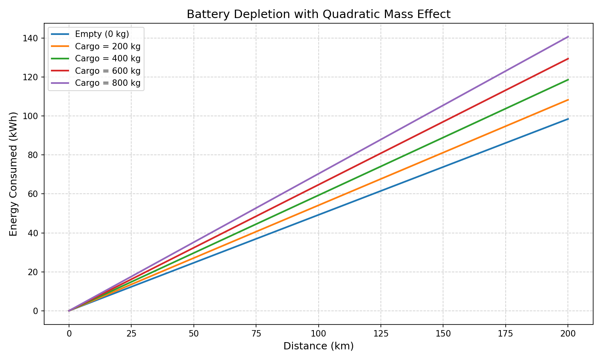

# Node 2: 二次能耗模型实现

## 概述

Node 2 的目标是建立一个**考虑载重非线性影响的能量消耗模型**，并绘制不同载重下的电池消耗曲线。实现采用纯 Python 函数（无类），使用 `numpy` 和 `matplotlib` 进行数值计算与可视化。

## 数学模型

每公里能耗 $E_{\text{km}}$ 与车辆总质量 $m_{\text{total}}$ 的关系为二次函数：

$$
E_{\text{km}} = \alpha \cdot m_{\text{total}}^2 + \beta \cdot m_{\text{total}} + \gamma
$$

其中：
- $m_{\text{total}} = m_{\text{vehicle}} + m_{\text{cargo}}$（单位：吨）
- $\alpha = 0.03$（kWh/km/ton²），$\beta = 0.15$（kWh/km/ton），$\gamma = 0.20$（kWh/km）
- $m_{\text{vehicle}} = 1.5$ 吨（空车质量）

行驶距离 $d$（km）后的总能耗为：

$$
E = d \times E_{\text{km}}
$$
以上为查询学习内容，不涉及现实数据（$\alpha \beta \gamma$均为模拟值）\
在这个模拟（Node 2）中，我设计了：energy_per_km，energy_consumed，plot_energy_curves三个函数用于实现能耗模型的计算和显示 \
[Code is here](Energy_test.py) \
